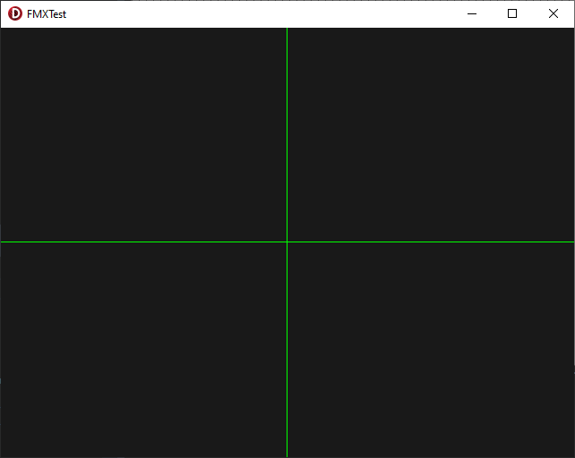

# CGE Test Forms

Two very simple projects, VCL + FMX variants of the same thing to test basic CGE functionality.

The code checks if there is a TCastleControl on the form. If so it will use that otherwise it will instantiate one at runtime so...

1) Load Project
2) Run
3) Delete TCastleContol component from form
4) Run again

The projects are like this to test both Design-Time and Runtime functionality. The component check is very basic so only the first discovered TCastleControl is used.

If a TCastleControl is present on the form a set of GREEN axis lines is drawn

If a TCastleControl is _not_ present on the form a set of RED axis lines is drawn

